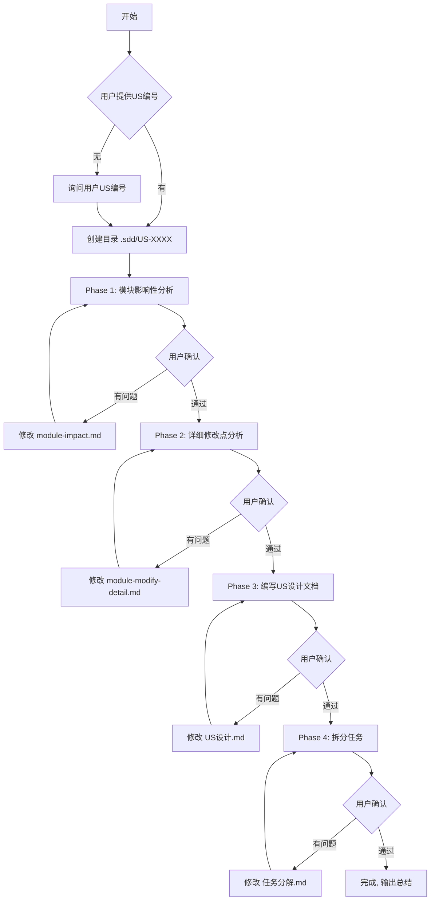

# us-design-writer 使用指南

## 目录

- [介绍](#介绍)
- [安装](#安装)
- [使用前提](#使用前提)
- [使用流程](#使用流程)
- [提示词案例](#提示词案例)

---

## 介绍

### 什么是 us-design-writer

`us-design-writer` 是一个结构化的需求设计文档生成器。它能帮助开发团队在编码之前，系统性地完成从需求分析到任务拆解的全流程设计工作。

### 为什么需要它

在软件开发中，"设计阶段"往往被忽视或做得不够深入，导致：

- 开发到一半发现设计漏洞，不得不返工
- 任务拆分不清晰，团队协作混乱
- 需求边界模糊，遗漏边界情况
- 回滚方案缺失，上线后进退两难

`us-design-writer` 通过强制执行**逐阶段设计 → 逐阶段确认**的流程，确保每个设计环节都经过充分思考和用户审核。

### 核心价值

| 价值 | 说明 |
|-----|-----|
| **结构化输出** | 强制输出标准格式的文档，不会遗漏关键章节 |
| **渐进式确认** | 每个阶段都需要用户确认，问题早发现早解决 |
| **任务可执行** | 拆分出的任务独立可验证，代码量可控 |
| **代码即文档** | 设计文档直接关联模块和文件，对应 software_architecture |

### 适用场景

- **新功能开发**: 从零开始的功能设计
- **功能重构**: 现有模块的重构方案设计
- **技术优化**: 性能、稳定性相关的优化设计
- **架构演进**: 系统架构升级或迁移方案
- **技术方案评审**: 评审前的方案准备

### 与传统方式的对比

| 维度 | 传统方式 | us-design-writer |
|-----|---------|------------------|
| 输出物 | 文档格式不统一 | 标准模板，格式统一 |
| 审核时机 | 开发后或上线前 | 开发前，逐阶段审核 |
| 模块影响 | 靠经验猜测 | 基于架构文档系统分析 |
| 任务拆分 | 粒度不均，难以验收 | 400行上限，DoD明确 |
| 存疑处理 | 随意决定或遗漏 | 强制标记 Open Question |

---

## 安装

### 自动安装

`us-design-writer` 是 opencode 的内置 skill，在支持的 opencode 版本中自动可用。

### 手动安装

如果你需要手动部署，将 skill 目录复制到 opencode 配置目录：

```bash
# 创建 skill 目录
mkdir -p ~/.config/opencode/skills/us-design-writer

# 复制 skill 文件
cp -r us-design-writer/* ~/.config/opencode/skills/us-design-writer/

# 验证安装
opencode --list-skills
```

---

## 使用前提

使用此 skill 前，确保项目根目录存在以下文件：

| 文件 | 说明 |
|-----|-----|
| `software_architecture.md` | 系统架构文档，定义各模块的职责边界 |

如果没有架构文档，skill 会提示你创建或识别模块。

---

## 使用流程

### 整体流程图



### 阶段详细说明

#### Phase 1: 模块影响性分析

**输出文件:** `.sdd/[US编号]/module-impact.md`

- 分析需求对各模块的修改可能性（高/中/低/无）
- 列出所有模块，不遗漏
- 如需新增模块，标记说明

#### Phase 2: 详细修改点分析

**输出文件:** `.sdd/[US编号]/module-modify-detail.md`

- 对高/中/低可能性的模块进行深度分析
- 明确具体修改文件和修改内容
- 修改内容使用自然语言描述

#### Phase 3: 编写US设计文档

**输出文件:** `.sdd/[US编号]/[US编号]-design.md`

包含内容：
- WHY（背景与目标）
- 影响范围（代码/接口/数据/构建/性能/安全）
- 实现方案（含流程图）
- 风险与回滚策略
- 验证和测试标准

#### Phase 4: 拆分任务

**输出文件:** `.sdd/[US编号]/[US编号]-task.md`

- 同一模块的修改放在一个任务
- 每个任务代码量不超过 400 行
- 每个任务独立可验证
- 包含 DoD checklist

### 用户确认环节

每个阶段结束后都会询问用户确认：
- **有问题** → subagent 根据反馈修改 → 重新确认
- **通过** → 进入下一阶段

---

## 提示词案例

以下是触发 `us-design-writer` 的推荐提示词。实际使用中，建议附带前期需求文档、分析报告等参考资料，帮助 AI 更准确地理解需求。

### 案例 1: 完整US设计（含PRD和API文档）

```
我需要为功能"用户权限细粒度控制"做详细设计，US编号是 US-2024-0156。

需求文档：
- PRD: docs/prd/权限系统v2.0 PRD.md
- API文档: docs/api/权限接口设计.md
- 页面原型: docs/mockup/权限配置页面.png

核心需求：
- 支持按资源类型设置不同的操作权限（读/写/删）
- 支持权限组批量授权
- 权限变更需要审计日志

参考现有实现：
- 当前权限模块在 src/auth/ 下
```

### 案例 2: 技术方案评审（含调研报告）

```
我要进行技术方案评审，需求是"消息队列迁移到Kafka"。

US编号: AR-2024-0089

前期分析：
- 调研报告: docs/mq/mq-migration-survey.md
- 性能测试报告: docs/mq/benchmark-report.md
- 数据流向图: docs/mq/data-flow.png

现有问题：
- 当前使用RabbitMQ，扩展性不足
- 峰值QPS 5万，目标支撑20万
- 需要保持消息顺序性

约束条件：
- 预算：迁移成本不超过50万
- 迁移窗口：2周内完成
```

### 案例 3: 任务拆分（已有设计文档）

```
请帮我拆分任务。

US编号: US-2024-0201
设计文档: .sdd/US-2024-0201/US-2024-0201-design.md

需求: 电商系统新增积分兑换功能
- 积分规则配置
- 积分兑换页面
- 兑换订单处理
- 积分流水记录

开发约束：
- 需要兼容现有积分系统
- 预计开发周期2周
```

### 案例 4: 快速启动（无US编号）

```
我有一个新需求要设计：
"在搜索结果中新增智能纠错提示功能"

需求背景：
- PRD: docs/prd/search-enhancement.md
- 竞品分析: docs/analysis/competitor-search.md

当用户输入的搜索词有错别字时，自动显示"您是要找：xxx"的提示。

请帮我创建US设计文档。
```

### 案例 5: 详细需求设计（含技术约束和验收标准）

```
需要为"实时协作编辑"功能做详细设计。

US编号: US-2024-0312

前期资料：
- PRD: docs/prd/collab-edit/prd.md
- 技术调研: docs/prd/collab-edit/tech-survey.md
- 用户调研: docs/prd/collab-edit/user-research.md

核心需求：
1. 支持多人同时编辑同一文档
2. 冲突解决策略：最后写入优先
3. 离线编辑后自动同步
4. 同步延迟要求 < 500ms

技术约束：
- 使用WebSocket通信
- 存储使用MongoDB
- 需要支持回滚操作

验收标准：
- 支持50人同时编辑
- 离线编辑内容不丢失
- 数据冲突率 < 0.1%
```

### 案例 6: 存量功能优化（含性能分析）

```
要优化登录模块的性能，需要详细设计。

US编号: OPT-2024-0045

分析报告：
- 性能分析报告: docs/performance/login-analysis.md
- APM链路追踪: docs/performance/login-trace.png
-火焰图: docs/performance/login-flamegraph.svg

背景：
- 当前登录平均耗时 850ms，P99 2s
- 目标：平均降至 200ms 以内，P99 500ms
- 瓶颈在密码验证环节（占比60%）

参考：
- 现有登录服务代码: src/auth/login/
```

### 案例 7: 数据库迁移（含数据字典和评估）

```
需要设计数据库从MySQL迁移到TiDB的方案。

US编号: DB-2024-0023

前期评估：
- 数据字典: docs/db/mysql-schema.md
- 数据量评估: docs/db/data-volume.md
- 兼容性报告: docs/db/tidb-compatibility.md

迁移范围：
- 用户表（2000万条记录）
- 订单表（1亿条记录）
- 商品表（500万条记录）

要求：
- 零停机迁移
- 数据一致性校验
- 回滚方案

限制：
- 迁移窗口：只能在凌晨2-6点
- 每次切换不超过100张表
```

### 案例 8: 多模块重构（含依赖分析）

```
需要对支付模块进行重构，请做详细设计。

US编号: REF-2024-0078

依赖分析：
- 模块依赖图: docs/refactor/payment-deps.png
- 调用链追踪: docs/refactor/payment-callchain.md

重构目标：
- 拆分为独立支付核心+渠道适配层
- 支持新增支付渠道零代码改动
- 消除循环依赖

当前问题：
- 所有渠道逻辑混在一个文件（5000+行）
- 新增渠道需要改核心代码
- 单测覆盖率不足30%

文档参考：
- 现有支付模块: src/payment/
```

---

## 输出目录结构

```
.sdd/
└── US-2024-0156/
    ├── module-impact.md          # 模块影响性分析
    ├── module-modify-detail.md   # 详细修改点
    ├── US-2024-0156-design.md    # US设计文档
    └── US-2024-0156-task.md      # 任务分解
```

---

## 注意事项

1. **存疑不猜测**: 设计过程中遇到不确定的问题，必须标记为 Open Question，不能自行决定
2. **模块引用**: 所有模块必须来自 `software_architecture.md` 定义，如需新增要明确说明
3. **用户确认**: 每个阶段都需要用户确认后才能进入下一阶段
4. **DoD标准**: 每个任务必须包含明确的验收标准（DoD checklist）