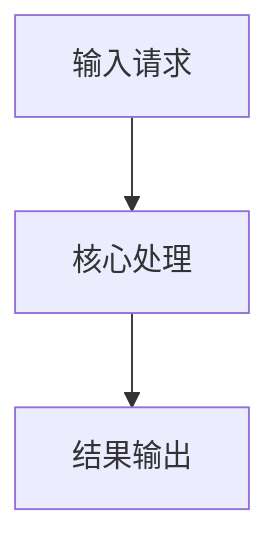

>重要：在写作过程中出现存疑，或者无法通过上下文进行决定，**不能做出任何猜测**，需要标记为存疑，并抛出问题

## 元信息
- 需求ID：[如 US-1234]
- 版本：[v1.0]
- 作者：[姓名]
- 评审人：[姓名/团队]
- 状态：[Draft/Reviewed/Approved]
- 日期：[YYYY-MM-DD]

# 变更：[变更描述]

## WHY
[问题描述，描述背景和现状，1-2句话]

### 目标指标
- 业务目标：[例如：提升握手成功率]
- 技术目标：[例如：降低平均耗时]
- 验收指标：[例如：P95 从 120ms 降到 90ms]

## 文档
[列出前期设计文档和相关资料，格式如下]
```text
xxx/###-feature/
├── xxx.md
├── xxx.md
└── xxx.md
```

## 变更内容
**新增文件：**
- xxx.c

**变更文件：**
- xxx.c

## 影响范围
### 代码影响
- [模块/目录/关键文件]

### 接口兼容性影响
- [是否涉及接口签名、协议字段、向后兼容策略]

### 数据影响
- [是否涉及数据结构、存储格式、迁移/清理]

### 构建与发布影响
- [编译选项、依赖、发布流程变更]

### 性能与容量影响
- [CPU/内存/延迟/吞吐变化预估]

### 安全影响
- [鉴权、输入校验、敏感数据、攻击面]

### 文档影响
- [需要同步更新的文档]

## 实现范围
[列出需要做和不能做的事情]

**需要做：**
- [必做项1]
- [必做项2]

**不能做：**
- [明确排除项1]
- [明确排除项2]

## 实现方案
### 核心机制
[描述需求的主要流程、核心能力，使用 mermaid 图表辅助]



### 实现细节
[描述数据结构设计、结构体设计、接口设计、错误码设计、规格等]

#### 数据结构设计
- [结构体/字段/约束/默认值]

#### 接口设计
- 接口原型：
```c
int xxx_api(const XxxInput *in, XxxOutput *out);
```
- 返回值：
  - `0`：成功
  - `!=0`：失败（见错误码）

#### 错误码设计
- `ERR_XXX_INVALID_ARG`：[含义]
- `ERR_XXX_TIMEOUT`：[含义]

#### 非功能约束
- 幂等性：[如何保证]
- 并发安全：[锁/无锁策略]
- 超时与重试：[策略与上限]
- 资源上限：[内存/句柄/连接数]

## 风险与回滚
### 主要风险
- [风险项1 + 触发条件 + 缓解措施]
- [风险项2 + 触发条件 + 缓解措施]

### 回滚策略
- 回滚开关：[配置项/编译开关]
- 回滚步骤：[步骤1/步骤2]
- 数据回滚：[是否需要、如何执行]

## 验证和测试
### 成功标准
[列出正常场景、异常场景、性能指标]

### 功能验证点
[描述验收点，例如通过测试用例、无失败场景]

### 回归范围
- [受影响回归测试集]

## 存疑汇总（Open Questions）
| ID | 章节 | 存疑描述 | 待确认问题 | 负责人 | 截止日期 |
|---|---|---|---|---|---|
| Q1 | 示例 | 【存疑】xxx | 需要确认 xxx 吗？ | 待定 | YYYY-MM-DD |
