# AI 代码审查 Agent 团队设计方案

> **核心模式**：`Map-Reduce + 清单协议`  
> **Agent 数量**：8 个（1 主控 + 7 子 Agent）

---

## 是什么？不是什么？

### ✅ 是什么

- **严格 Review 的工具**：AI 生成代码太快，质量由开发人员作为**第一责任人**，我们需要对 AI 的输出进行严格的 review
- **边界检查器**：帮助发现 US/SDD 偏差、测试漏洞、规范问题
- **效率放大器**：并行执行多个专项检查，提升 Review 效率

### ❌ 不是什么

- **责任转移器**：Review 结果不能作为"AI 审过了我没错"的借口
- **质量保证书**：不能保证 AI 生成的代码 100% 正确，没有银弹
- **自动化放行线**：所有问题都需要开发人员判断和确认

> **核心定位**：这是一把更精确的放大镜，让我们更好地履行第一责任人职责，而不是替我们担责。


## 🤔 为什么需要 Agent 团队？

### AI 写代码为什么会出错？

当上下文太长时，AI 会**压缩丢失细节**，导致：
- 遗漏边界条件
- 记混变量名、字段名
- 忽略特殊场景

### AI 做 Code Review 同样会犯错！

**同样的原因，同样的错误**：
- 上下文太长 → 压缩丢失 US/SDD 的细节
- 维度太多 → US 合规、SDD 合规、测试有效、规范检查...全部混在一起
- 注意力分散 → 什么都要看，什么都看不住

### 规避策略：拆 + 并行 + 清单

```
拆：将多维度拆分为单一职责
     US合规 │ SDD合规 │ 测试有效 │ 代码规范
       ↓         ↓         ↓         ↓
     Agent     Agent     Agent     Agent

并行：各自独立，互不干扰
     每个 Agent 只读自己需要的上下文
     上下文精简，不压缩，不丢失

清单：用 JSON 协议做数据交换
     精确溯源（REQ-ID、ARCH-ID、IMP-ID）
     主控 Agent 最后汇总，不丢信息
```

**核心优势**：
- 每个 Agent 只关注**单一维度**，上下文精简不压缩
- 并行执行，效率提升
- 清单协议实现**精确溯源**


---

## 1. 核心诉求与解决映射

| 🎯 诉求 | 📋 问题描述 | 🛠️ 解决 Agent |
|:-------:|:-----------|:-------------|
| **防止幻觉** | AI 生成 US/SDD 中未要求的代码 | `compliance_judge`（超纲检查） |
| **防止遗漏** | AI 遗漏 US/SDD 中的要求 | `compliance_judge`（缺失检查） |
| **需求理解偏差** | US 与代码实现颗粒度不一致 | `compliance_judge`（冲突检查） |
| **测试无效** | UT 无法拦截核心逻辑被篡改 | `test_auditor` |
| **架构腐化** | 代码违反 SDD 依赖规则 | `sdd_compliance_judge` |

---

## 2. Agent 职责总览

### 👑 主控 Agent

| Agent | 文件 | 职责 |
|:------|:-----|:-----|
| **us_reviewer** | `us_reviewer.md` | 调度子任务，阶段0文档检查，读取 JSON 报告，整合生成最终 Markdown 报告 |

---

### 🔄 阶段1：标准化（Map）

| Agent | 文件 | 输入 | 输出 |
|:------|:-----|:-----|:-----|
| **spec_normalizer** | `spec_normalizer.md` | US 文档 | `checklist.json`（REQ 清单） |
| **sdd_spec_normalizer** | `sdd_spec_normalizer.md` | SDD 文档 | `sdd_checklist.json`（ARCH 清单） |
| **code_semantor** | `code_semantor.md` | Code Diff | `impl_facts.json`（IMP 事实） |

---

### ⚖️ 阶段2：审查（Reduce）

| Agent | 文件 | 输入 | 输出 |
|:------|:-----|:-----|:-----|
| **compliance_judge** | `compliance_judge.md` | `checklist.json` + `impl_facts.json` | `alignment_report.json` |
| **sdd_compliance_judge** | `sdd_compliance_judge.md` | `sdd_checklist.json` + `impl_facts.json` | `sdd_compliance_report.json` |
| **test_auditor** | `test_auditor.md` | `checklist.json` + Code + Test | `test_audit_report.json` |

---

## 3. 完整工作流架构

### 📊 流程图

```mermaid
flowchart LR
    subgraph INPUT["📥 输入"]
        US[US 设计文档]
        SDD[SDD 架构文档]
        CODE[Code Diff]
        TEST[单元测试]
    end

    subgraph PHASE0["🔍 阶段0"]
        CHECK[文档完备性检查]
    end

    subgraph NORMALIZE["🔄 阶段1：标准化（并行）"]
        SN[spec_normalizer]
        SSN[sdd_spec_normalizer]
        CS[code_semantor]
    end

    subgraph JUDGE["⚖️ 阶段2：审查（并行）"]
        CJ[compliance_judge]
        SJ[sdd_compliance_judge]
        TA[test_auditor]
    end

    subgraph MERGE["✅ 阶段3"]
        HOST[us_reviewer<br/>整合报告]
    end

    INPUT --> PHASE0
    PHASE0 --> NORMALIZE
    NORMALIZE --> JUDGE
    JUDGE --> MERGE
```



### 📁 数据流

```
                           ┌─────────────────┐
                           │   us_document   │
                           └────────┬────────┘
                                    │
                    ┌───────────────┼───────────────┐
                    │               │               │
                    ▼               ▼               ▼
             ┌───────────┐   ┌───────────┐   ┌───────────┐
             │   spec_   │   │  sdd_spec │   │   code_   │
             │ normalizer│   │ normalizer│   │ semantor  │
             └─────┬─────┘   └─────┬─────┘   └─────┬─────┘
                   │               │               │
                   ▼               ▼               ▼
            checklist.json  sdd_checklist.json impl_facts.json
                   │               │               │
                   │               │               │
                   └───────┬───────┴───────┬───────┘
                           │               │
                           ▼               ▼
                    ┌─────────────┐ ┌─────────────┐
                    │ compliance_ │ │    sdd_     │
                    │   judge     │ │compliance_  │
                    │             │ │   judge     │
                    └──────┬──────┘ └──────┬──────┘
                           │               │
                           ▼               ▼
                  alignment_report   sdd_compliance_
                           │              report
                           │               │
                           │   ┌───────────┘
                           │   │
                           ▼   ▼
                    ┌─────────────┐
                    │ us_reviewer │
                    │  （主控）   │
                    └──────┬──────┘
                           │
                           ▼
                    最终 Markdown 报告
```

---

## 5. 并行执行优化

### ⚡ 核心原则：单次 toolCall 并行启动

> 主 Agent 必须**在单次 task toolCall 中并行启动多个 subagent**，而不是分多次调用。

#### ✅ 正确做法

```javascript
// 在一次 toolCall 中同时发起四个任务
task(description="阶段1标准化任务", subagent_type="spec_normalizer", prompt="...")
task(description="阶段1标准化任务", subagent_type="sdd_spec_normalizer", prompt="...")
task(description="阶段1标准化任务", subagent_type="code_semantor", prompt="...")

// 在一次 toolCall 中同时发起三个任务
task(description="阶段2审查任务", subagent_type="compliance_judge", prompt="...")
task(description="阶段2审查任务", subagent_type="sdd_compliance_judge", prompt="...")
task(description="阶段2审查任务", subagent_type="test_auditor", prompt="...")
```

#### ❌ 错误做法（顺序执行）

```javascript
// 分多次 toolCall - 效率低下
task(description="任务1", subagent_type="spec_normalizer", ...)
await // 等待完成
task(description="任务2", subagent_type="sdd_spec_normalizer", ...)
await // 等待完成
task(description="任务3", subagent_type="code_semantor", ...)
// ...
```

---

## 6. 上下文管理策略

### 📋 核心原则：JSON 互不干涉

| Agent | 📖 读取 | 🚫 不读 |
|:------|:--------|:--------|
| `spec_normalizer` | `us_document` | 任何 JSON |
| `sdd_spec_normalizer` | `sdd_document` | 任何 JSON |
| `code_semantor` | `code_diff` | 任何 JSON |
| `compliance_judge` | `checklist.json`, `impl_facts.json` | US 原文、SDD 原文 |
| `sdd_compliance_judge` | `sdd_checklist.json`, `impl_facts.json` | US 原文、SDD 原文、`code_diff` |
| `test_auditor` | `us_document`, `code_diff`, `test_code`, `checklist.json` | SDD 原文 |
| `us_reviewer` | 所有 JSON 报告文件 | 无 |

### 📁 文件交互协议

```
所有中间产物强制存储在：
~/.config/opencode/tmp/

文件列表：
├── checklist.json              # spec_normalizer 输出
├── sdd_checklist.json          # sdd_spec_normalizer 输出
├── impl_facts.json             # code_semantor 输出
├── alignment_report.json       # compliance_judge 输出
├── sdd_compliance_report.json  # sdd_compliance_judge 输出
└── test_audit_report.json      # test_auditor 输出
```

---

## 7. 诉求-Agent 矩阵

| Agent | 🌀 防止幻觉 | 📭 防止遗漏 | ⚖️ 需求偏差 | 🧪 测试无效 | 🏛️ 架构腐化 | 📏 规范检查 | 📄 文档完备 |
|:------|:-----------:|:-----------:|:-----------:|:-----------:|:-----------:|:-----------:|:-----------:|
| `spec_normalizer` | ✅ | ✅ | ✅ | | | | |
| `sdd_spec_normalizer` | | | | | ✅ | | |
| `code_semantor` | ✅ | | ✅ | | ✅ | | |
| `compliance_judge` | ✅ | ✅ | ✅ | | | | |
| `sdd_compliance_judge` | | | | | ✅ | | |
| `test_auditor` | | | | ✅ | | | |
| `us_reviewer` | | | | | | | ✅ |

---

## 8. 输出文件规范

### 📄 阶段1输出

| 📁 文件 | 格式 | 生成 Agent |
|:--------|:-----|:----------|
| `checklist.json` | `{requirements: [{id, type, content, source}]}` | `spec_normalizer` |
| `sdd_checklist.json` | `{requirements: [{id, type, content, source}]}` | `sdd_spec_normalizer` |
| `impl_facts.json` | `{implementations: [{id, content, location}]}` | `code_semantor` |

### 📄 阶段2输出

| 📁 文件 | 格式 | 生成 Agent |
|:--------|:-----|:----------|
| `alignment_report.json` | `{alignment_report: {total_violations, violations}}` | `compliance_judge` |
| `sdd_compliance_report.json` | `{sdd_compliance_report: {total_violations, violations}}` | `sdd_compliance_judge` |
| `test_audit_report.json` | `{type, audit_result, req_coverage, summary}` | `test_auditor` |

---

## 9. Agent 人设强化

### ⚖️ compliance_judge - 冷血审计官

> **信条**："发现问题 = 有效工作，没发现问题 = 可能漏检"

| 要求 | 说明 |
|:-----|:-----|
| **todolist 追踪** | 必须使用 todolist 逐类型审查：Missing → Hallucination → Conflict |
| **明确结论** | 对每条 REQ 都要有明确的"通过"或"不通过"结论 |
| **精确定位** | 每个问题必须包含具体文件路径+行号 |
| **禁止词汇** | 禁止使用"优雅、完善、不错"等主观评价词 |
| **宁可误报** | 不确定的边界情况要标记为问题 |

---

### ⚖️ sdd_compliance_judge - 架构合规法官

> **信条**："架构是系统的骨架，任何破坏都是严重问题"

| 违规类型 | 定义 | 示例 |
|:---------|:-----|:-----|
| `dependency_violation` | 违反模块依赖约束 | OrderService 直接访问 UserDao |
| `layer_violation` | 违反分层架构原则 | Controller 层直接操作数据库 |
| `interface_violation` | 接口暴露方式不符约定 | 直接暴露内部 Service 而非 Facade |
| `convention_violation` | 违反编码规范约束 | 异常处理方式不符合约定 |

---

### 🛡️ test_auditor - 测试质量审计员

> **信条**："测试存在 ≠ 测试有效"

| 覆盖状态 | 定义 |
|:---------|:-----|
| `fully_covered` | 有有效测试覆盖核心逻辑 |
| `partially_covered` | 有测试但断言不够强，或只测了边界 |
| `not_covered` | 完全没有任何测试覆盖 |
| `fake_covered` | 有测试代码但断言永远通过或永远失败（无效测试）|

| 无效测试类型 | 特征 |
|:-------------|:-----|
| `always_pass` | 断言恒为 true，如 `assertTrue(true)` |
| `always_fail` | 断言恒为 false，如 `assertTrue(false)` |
| `mock_all_no_verify` | mock 了所有外部依赖，测试内无任何验证 |
| `empty_test` | 测试方法体为空，或只有 pass |
| `duplicate` | 与其他测试完全重复，无额外价值 |
| `weak_assertion` | 断言过于宽松，核心逻辑未真正验证 |

---

## 10. 最终报告模板

主 Agent 读取所有 JSON 报告后，生成以下结构的 Markdown 报告：

```markdown
# 🤖 深度代码审查报告 (US对齐与防御分析)

## 🚦 审查结论速览
- **设计符合度**: [✅ 完全一致 / ⚠️ 存在偏差 / 🔴 严重偏离]
- **SDD 合规性**: [✅ 架构合规 / ⚠️ 存在偏差 / 🔴 架构违规]
- **测试防护力**: [✅ 拦截有效 / ⚠️ 存在假阳性测试 / 🔴 缺乏关键断言]
- **代码规范**: [✅ 规范良好 / ⚠️ 存在规范问题 / 🔴 存在严重规范问题]
- **发现 US 偏差数**: [X 处]
- **发现 SDD 违规数**: [X 处]

---

## ⚖️ US 设计偏离分析
> 审计员指令：本节仅展示代码实现与US设计的差异点。

| 偏差类型 | US设计依据 (REQ-ID) | 代码实际行为 (IMP-ID + 行号) | 风险评估 |
|---|---|---|---|
| [🚨缺失 / ⚠️超纲 / ❌冲突] | [REQ-001] US-3.1 要求... | [IMP-002] UserService.java:45... | [具体问题] |

---

## 🏗️ SDD 架构合规分析
> 审计员指令：本节展示代码实现与 SDD 架构约束的偏离。

| 违规类型 | SDD约束依据 (ARCH-ID) | 代码实际行为 | 风险评估 |
|---|---|---|---|
| [🚨依赖违规 / ⚠️分层违规 / ❌接口违规] | [ARCH-001] SDD-3.2 要求... | [IMP-003] OrderService.java:23... | [后果] |

---

## 🛡️ 测试用例有效性分析

### 需求-测试映射分析

| REQ-ID | 需求描述 | 覆盖测试 | 有效性 |
|---|---|---|---|
| [REQ-001] | [用户登录时必须验证密码非空] | [testPasswordNotEmpty] | [✅/⚠️/🔴] |

### 冗余测试清单

| 测试方法 | 冗余类型 | 说明 |
|---|---|---|
| [testDuplicate] | [重复] | 与 xxx 测试验证相同 REQ-ID |

### 未覆盖需求

| REQ-ID | 需求描述 | 风险等级 |
|---|---|---|
| [REQ-002] | [密码长度必须 >= 8 位] | [高/中/低] |

---

## 📝 关键逻辑修改点梳理

### 修改点 1: [文件路径/类名]
- **实际发生了什么?** [基于 impl_facts 提取的客观事实]
- **数据流转变化:** [从 X 变为 Y]
- **US 溯源:** [REQ-xxx 对应 US-x.x 要求]

---

## 🧠 维护建议 (可选)
- **异常处理盲区**: [指出代码中是否有吞没异常或不规范抛出]
- **复杂度预警**: [指出是否有过深的 if-else 嵌套或魔法数字]
- **架构风险**: [如有 SDD 违规，指出可能的维护困难]
```

---


## 📎 附录

### Agent 文件清单

```
agents/us_reviewer/
├── us_reviewer.md              # 主控 Agent
├── spec_normalizer.md          # US 标准化
├── sdd_spec_normalizer.md      # SDD 标准化
├── code_semantor.md            # 代码语义提取
├── compliance_judge.md         # US 合规审查
├── sdd_compliance_judge.md     # SDD 合规审查
└── test_auditor.md             # 测试审计
```

---

*文档版本：v1.0 | 最后更新：2026-04-16*